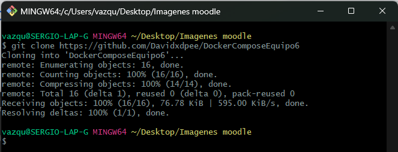

# Instalacion de Moodle con docker con el Equipo6

## Moodle y dependencias
- Instalacion con docker-compose
- Si no esta instalado el docker compose podemos obtenerlo mediante  el siguiente comando:
   
```bash
sudo apt install docker-compose
``` 
# Procedimiento
## Paso 1) Clonar el repositorio

1. Clonar el repositorio al directorio local de instalación
    git clone https://github.com/Davidxdpee/DockerComposeEquipo6



## Paso 2) Correr Moodle

1. Para correr los contenedores

```bash
cd DockerComposeEquipo6
``` 
    


    docker-compose up -d


  - Para comprobar que los contenedores esten funcionando correctamente podemos usar:
```bash
docker-compose ps
``` 


2. Para detener los contenedores
```bash
docker compose down
``` 


# Paso 3)Login en Moodle
1. Credenciales Admin
  - http://localhost/
  - Username: `user`
  - Password: `bitnami`

2.- Damos click en Login e ingresamos las credenciales para entrar al modo administrador


3.- Como podemos observar ya estariamos logueados


# Paso 4)Creacion de un curso
1. Habilitamos el modo edicion


  - De esta forma se veria con el modo de edicion activo


2. Accedemos al apartado "Mis cursos"


3. Le damos click a los 3 puntos y despues "Nuevo Curso"


4. Rellenamos los campos necesarios


5. Confirmamos los datos y le damos en guardar


6. Nos mandara dentro del curso donde ahora podemos agregar las actividades y demas propias que pueda contener nuestro curso


7. Si regresamos al apartado de "Mis cursos" podemos observar todos los cursos existentes (Aqui deberiamos visualizar el que acabamod de crear)


